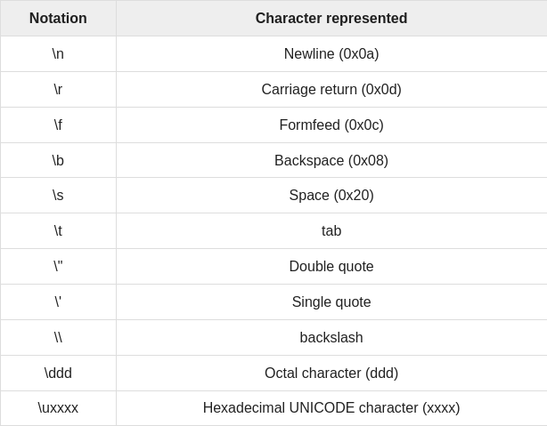

# Primitive Data Types
These are the predefined data types of Java. 

Variables are nothing but reserved memory locations to store values.


They specify the size and type of any standard values.

Java has 8 data types:

1. byte: 

    * It's an 8-bit signed two's complement integer
    * Min: -128 (-2^-7)
    * Max: 127 (2^7 -1)
    * Default: 0
    * Used to save space in large arrays, mainly in place of integers, since a byte is four times smaller than an integer
    * `byte a = 100, byte b = -50`.
2. short:

    * It's a 16 bit signed two's complement integer.
    * Min: -32,768 (2^-15).
    * Max: 32,767 (2^15 -1).
    * Default: 0.
    * Used to save memory as byte data type. A short is 2 times smaller than an integer.
    * `short a = 10000, short r = -20000`.
3. int: 

    * It's a 32 bit signed two's complement integer.
    * Min: - 2,147,483,648 (2^-31).
    * Max: 2,147,483,647 (2^31 -1).
    * Default: 0.
    * Used as the default data type for integral values unless there's a concern about memory.
    * `int a = 100000, int r = -200000`.
4. long:

    * It's a 64 bit signed two's complement integer.
    * Min: -9,223,372,036,854,775,808 (2^-63).
    * Max: 9,223,372,036,854,775,807 (2^63 -1).
    * Default: 0L.
    * Used when a wider range than int is needed.
    * `long a = 1000000L, long r = -200000L`.

5. float

    * It's a single precision 32-bit  IEEE 754 floating point.
    * Mainly used to save memory in large arrays of floating point numbers.
    * Default: 0.0f.
    * Never used for precise values such as currency.
    * `float f1 = 234.5f`.

6. double: 

    * It's a double precision 64-bit  IEEE 754 floating point.
    * Generally used as the default data type for decimal values, generally the default choice.
    * Default: 0.0d.
    * Never used for precise values such as currency.
    * `double d1 = 123.4`.
7. char:

    * Single 16-bit unicode character.
    * Min: '\u0000' (0).
    * Max: '\uffff' (65,535).
    * Used to store any character.
    * `char letterA = 'A'`.
8. boolean:

    * Represents one bit of information.
    * 2 possible values: true or false.
    * Used for simple flags that track true/false conditions.
    * Default: false.
    * `boolean one = true`.

When a variable is copied then another copy of the variable is created and changes made to the copied variable will not reflect changes in the original variable.

# Object Data Type===Reference Datatypes
* Created using defined constructors of the classes.
* Used to access objects.
* Declared to be a specific type and cannot change.
* Class objects and various type of array variables come under reference datatype.
* Default: null.
* A reference variable can be used to refer to any object of the declared type or any compatible type.
* `Animal animal = new Animal('giraffe')`.
# Java literals
* It's a source code representation of a fixed value.
* They are represented direcctly in the codewithout any computation.
* They can be assigned to any primitive type variable:
```Java
byte a = 68;
char a = 'A';
```
* byte, int, long, short can be expressed in decimal, hexadecimal, or octal number systems.

    * Prefix 0 is used to indicate octal, and 0x hexadecimal.
    ```Java
    int decimal = 100;
    int octal = 0144;
    int hexa =  0x64;
    ```

* String literals are specified by enclosing a sequence of characters between a pair of double quotes.
```JAVA
"Hello World"
"two\nlines"
"\"This is in quotes\""
```
* String and char types of literals can contain unicode characters.
```JAVA
char a = '\u0001';
String a = "\u0001";
```

## Escape sequences

