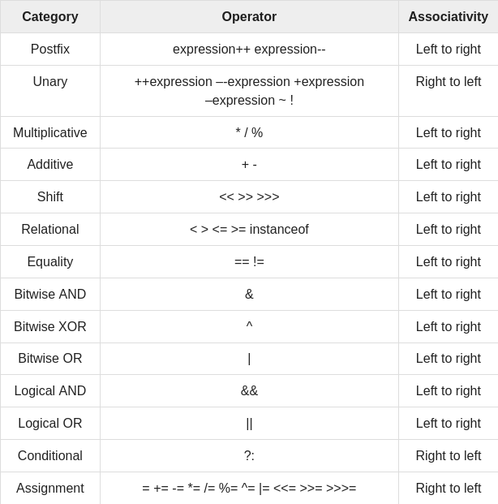

# Basic Operators
## Arithmetic Operators
* This are used in mathematical expressions in the samy way they are used in algebra.

    1. Addition (+): adds values on either side of the operator.
    2. Substraction (-): substracts right-hand operand from the left-hand operand.
    3. Multiplication (*): multiplies values on either side of the operator.
    4. Division (/): divides left-hand operand by right-hand operand.
    5. Modulus (%): Divides left-hand operand by right-hand operand and returns the remainder.
    6. Increment(++): Increases the value of the operand by 1.
    7. Decrement (--): Decreases the value of operand by 1.
## Relational Operators
* They compare two values.
    
    1. Equal to (==): Checks if the values of two operands are equal or not, if yes then the condition becomes true.
    2. Not equal to (!=): Checks if the values of two operands are equal or not, if values are not equal then condition becomes true.
    3. Greater than (>): Checks if the value of left operand is bigger than the value of the right operand, if yes returns true.
    4. Less than (<): Checks if the value of left operand is less than the value of right operand, if yes the condition becomes true.
    5. Greater than or equal to (>=): Checks if the value of left operand is greater than or equal to the value of right operand, if yes condition returns true.
    6. Less than or equal to (<=): Checks if the value of left operand is less than or equal to the value of right operand, if yes condition returns true.
## Bitwise Operators
* Java defines this operators to perform bit-by-bit operations

    1. AND(&): Copies a bit to the result if it exists in both operands.
    2. OR(|): Copies a bit if it exists in either operand.
    3. XOR (^): Copies the bit if it is set in one operand but not both.
    4. Compliment (~): Flips the bits of one variable.
    5. Left shift (<<): The left operand value is moved left by the number of bits specified by the right operand.
    6. Right shift (>>): The left operand value is moved right by the number of bits specified by the right operand.
    7. Zero fill right shift (>>>): The left operand value is moved right by the number of bits specified by the right operand and shifted values are filled up with zeros.
## Logical Operators
* To meet more than one condition.
    1. Logical AND(&&): If both operands are non-zero, it becomes true.
    2. Logial OR(||): If one of the operands is non-zero, it becomes true.
    3. Logical NOT (!): It reverses the state of its operand.
## Assignment Operators
* 
    1. = : simple assignment operator.
    2. += : adds the right operand to the left operand and assign the result to the left operand.
    3. -= : substracts the right operand to the left operand and assign the result to the left operand.
    4. *= : multiply the right operand to the left operand and assign the result to the left operand.
    5. /= : divides the left operand with the right operand and assign the result to the left operand.
    6. %= : takes modulus using two operands and assign the result to the left operand.
    7. <<= : left shift AND assignment operator.
    `C<<=2` is equal to `C = C<<2`.
    8. '>>=' : right shift AND assignment operator.
    `C>>=2` is equal to `C = C>>2`.
    9. &= : bitwise AND assignment operator.
    10. ^= : bitwise XOR and assignment operator.
    11. |= : bitwise OR and assignment operator.
## Misc Operators
* Conditional Operator a.k.a Ternary (? : )
    
    * Consists of three operands and is used to evaluate Boolean expressions. 
    * Its goal is to decide, which value should be assigned to the variable.
    * `variable x = (expression) ? value if true :  value if false`.
* instanceof operator

    * It is used only for objet reference variables.
    * It checks whether the object is of a particular type.
    * `(Object reference variable) instanceof (class/interface type)`.
    * If it passes the test it'll return true.
## Precedence of operators
* This determines the grouping in terms of the expression.
* This affects how an expression is evaluated.
* In the next table elements at the top will be the ones evaluated first
