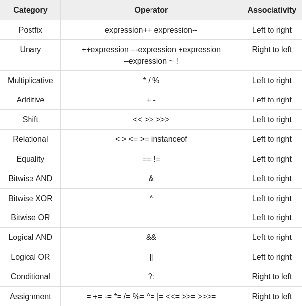

# Conditional Expressions

## Relational Operators

- They compare two values.
  1. Equal to (==): Checks if the values of two operands are equal or not, if yes then the condition becomes true.
  2. Not equal to (!=): Checks if the values of two operands are equal or not, if values are not equal then condition becomes true.
  3. Greater than (>): Checks if the value of left operand is bigger than the value of the right operand, if yes returns true.
  4. Less than (<): Checks if the value of left operand is less than the value of right operand, if yes the condition becomes true.
  5. Greater than or equal to (>=): Checks if the value of left operand is greater than or equal to the value of right operand, if yes condition returns true.
  6. Less than or equal to (<=): Checks if the value of left operand is less than or equal to the value of right operand, if yes condition returns true.

## Bitwise Operators

- Java defines this operators to perform bit-by-bit operations

  1. AND(&): Copies a bit to the result if it exists in both operands.
  2. OR(|): Copies a bit if it exists in either operand.
  3. XOR (^): Copies the bit if it is set in one operand but not both.
  4. Compliment (~): Flips the bits of one variable.
  5. Left shift (<<): The left operand value is moved left by the number of bits specified by the right operand.
  6. Right shift (>>): The left operand value is moved right by the number of bits specified by the right operand.
  7. Zero fill right shift (>>>): The left operand value is moved right by the number of bits specified by the right operand and shifted values are filled up with zeros.

## Logical Operators

- To meet more than one condition.
  1. Logical AND(&&): If both operands are non-zero, it becomes true.
  2. Logial OR(||): If one of the operands is non-zero, it becomes true.
  3. Logical NOT (!): It reverses the state of its operand.

## Assignment Operators

- 1. = : simple assignment operator.
  2. += : adds the right operand to the left operand and assign the result to the left operand.
  3. -= : substracts the right operand to the left operand and assign the result to the left operand.
  4. \*= : multiply the right operand to the left operand and assign the result to the left operand.
  5. /= : divides the left operand with the right operand and assign the result to the left operand.
  6. %= : takes modulus using two operands and assign the result to the left operand.
  7. <<= : left shift AND assignment operator.
     `C<<=2` is equal to `C = C<<2`.
  8. '>>=' : right shift AND assignment operator.
     `C>>=2` is equal to `C = C>>2`.
  9. &= : bitwise AND assignment operator.
  10. ^= : bitwise XOR and assignment operator.
  11. |= : bitwise OR and assignment operator.

## Misc Operators

- Conditional Operator a.k.a Ternary (? : )
  - Consists of three operands and is used to evaluate Boolean expressions.
  - Its goal is to decide, which value should be assigned to the variable.
  - `variable x = (expression) ? value if true : value if false`.
- instanceof operator

  - It is used only for objet reference variables.
  - It checks whether the object is of a particular type.
  - `(Object reference variable) instanceof (class/interface type)`.
  - If it passes the test it'll return true.

## Precedence of operators

- This determines the grouping in terms of the expression.
- This affects how an expression is evaluated.
- In the next table elements at the top will be the ones evaluated first
  
