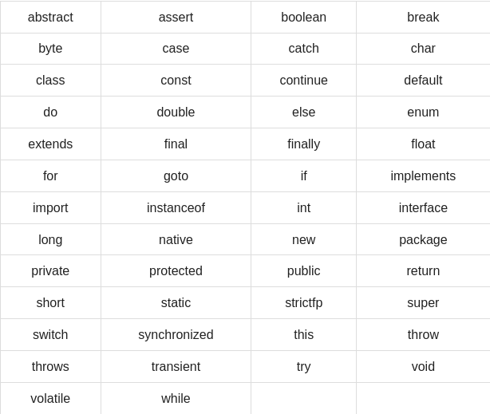

# JAVA
## Overview
1. OOP
2. Platform independent
3. Secure
4. Architecure neutral
5. Portable
6. Robust
## Applications
1. Multhithreaded 
2. Interpreted
3. High performance 
4. Distributed
5. Dynamic
## Installation 
sudo apt install default-jre
## Important concepts of JAVA
1. Object
2. Class
3. Methods
4. Instance variables
## Running a program
1. Create your file with .java extension, it should have the same name as your class.
Example: HelloWorld.java
```Java
public class HelloWorld {
   public static void main(String[] args) {
      // Prints "Hello, World" in the terminal window.
      System.out.println("Hello, World");
   }
}
```
2. Compile the program to generate the .class file
`javac HelloWorld.java` will generate a file HelloWorld.class
3. Run your program
`java HelloWorld`.
## Basic Syntax
* Case sensitive.
* Class name: the first letter should be UPPERCASE
* Method name: the first letter should be lowercase.
* Program file name: Name of the file should match exactly the class name
* `public static void main(String args[])` java program processing starts from the main() method which is mandatory for every Java program
## JAVA identifiers
* The have to start with a letter or an underscore or a currency character (A-Z, a-z, $, _).
## Java Modifiers
* Access modifiers: default, public, protected, private.
* Non-access modifiers: final, abstract, strictfp
## Java Variables
* Local variables.
* Class variables- static variables.
* Instance variable- non-static variables.
## Java Arrays
* They are OBJECTS that store multiple variables of the same type. However an array is an object on the heap.
## Java Enums
* Introduced in Java5.0
* They restric a variable to have one of only a few predefined values.
* This predefined values in this enumerated list are called enums.
* This makes it possible to reduce bugs.
* They can be declared as their own or inside a class. 
* Methods, variables, constructors can be defined inside enums as well.
## Java Keywords

* They cannot be used as costant or variable names.
## Comments
* Multiline `/**/`.
* One line `//`.
## Inheritance
* Classes can be derived from classes.
* They are useful for when you want to create a new class and there is already a class that has some code you require, then it is possible to to derive your new class from the already existing code.
* This concept allows you to reuse the fields and methos of the existing class without having to rewrite the code in a new class.
* In this scenario the existing class is called the **superclass** and the derived class **subclass**.
## Interface
* It can be defined as a contract between objects on how to communicate with each other.
* They play a vital role when it comes to the concept of inheritance.
* It defines the methods, a deriving class should use. But the implementation of them is tottally up to the subclass.

